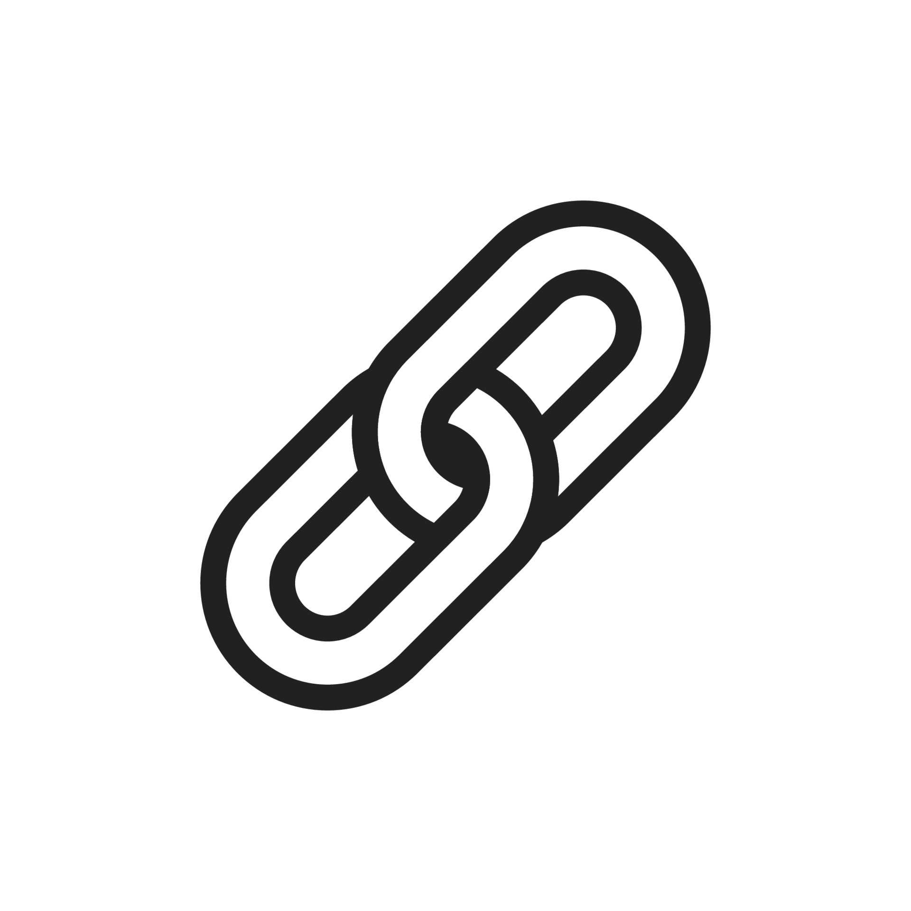
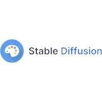

[![Contributors][contributors-shield]][contributors-url]
[![Forks][forks-shield]][forks-url]
[![Stargazers][stars-shield]][stars-url]
[![Issues][issues-shield]][issues-url]
[![Apache License 2.0][license-shield]][license-url]
[![Discord][discord-shield]][discord-url]

<br />
<div align="center">
  <a href="https://civitai.com/">
    
  </a>
  
  
</div>

# Civitai Link Desktop

Manage and interact with your StableDiffusion instance right from Civitai

## Table of Content

- [Recommended IDE Setup](#recommended-ide-setup)
- [Project Setup](#project-setup)
  - [Install](#install)
  - [Development](#development)
  - [Build](#build)
- [FAQ](#faq)
- [Contributing](#contributing)
- [License](#license)

## Recommended IDE Setup

- [VSCode](https://code.visualstudio.com/) + [ESLint](https://marketplace.visualstudio.com/items?itemName=dbaeumer.vscode-eslint) + [Prettier](https://marketplace.visualstudio.com/items?itemName=esbenp.prettier-vscode)

## Project Setup

### Install

```bash
$ npm install
```

### Development

```bash
$ npm run dev
```

### Build

```bash
# For windows
$ npm run build:win

# For macOS
$ npm run build:mac

# For Linux
$ npm run build:linux
```

## FAQ

### What the Civitai Link Key? Where do I get it?

The Civitai Link Key is a short 6 character token that you'll receive when setting up your Civitai Link instance (you can see it referenced here in this [Civitai Link installation video](https://civitai.com/v/civitai-link-installation)). The Link Key acts as a temporary secret key to connect your Stable Diffusion instance to your Civitai Account inside our link service.

Since Civitai Link is still in alpha, it is currently only available to Supporters as part of the Civitai Early Access program. You can get access to Civitai Link today by [becoming a supporter](https://civitai.com/pricing) 🥰 or you can wait until we've gotten it to a state that we're ready for a full release.

## Filing an Issue

When filing an issue provide as much replication and detail as possible. It can also help if you paste your app logs into your issue.

```
on Linux: ~/.config/{app name}/logs/main.log
on macOS: ~/Library/Logs/{app name}/main.log
on Windows: %USERPROFILE%\AppData\Roaming\{app name}\logs\main.log
```

## Contributing

Any contributions you make are **greatly appreciated**.

If you have a suggestion that would make this better, please fork the repo and create a pull request. You can also simply open an issue with the tag "enhancement".
Don't forget to give the project a star! Thanks again!

1. Fork the repository to your own GitHub account.
2. Create a new branch for your changes.
3. Make your changes to the code.
4. Commit your changes and push the branch to your forked repository.
5. Open a pull request on our repository.

Hop into the development channel in our [Discord server](https://discord.gg/UwX5wKwm6c) and let's chat!

## License

Apache License 2.0 - Please have a look at the [LICENSE](/LICENSE) for more details.

[contributors-shield]: https://img.shields.io/github/contributors/civitai/civitai-link-desktop.svg?style=for-the-badge
[contributors-url]: https://github.com/civitai/civitai-link-desktop/graphs/contributors
[forks-shield]: https://img.shields.io/github/forks/civitai/civitai-link-desktop.svg?style=for-the-badge
[forks-url]: https://github.com/civitai/civitai-link-desktop/network/members
[stars-shield]: https://img.shields.io/github/stars/civitai/civitai-link-desktop.svg?style=for-the-badge
[stars-url]: https://github.com/civitai/civitai-link-desktop/stargazers
[issues-shield]: https://img.shields.io/github/issues/civitai/civitai-link-desktop.svg?style=for-the-badge
[issues-url]: https://github.com/civitai/civitai-link-desktop/issues
[license-shield]: https://img.shields.io/github/license/civitai/civitai-link-desktop.svg?style=for-the-badge
[license-url]: https://github.com/civitai/civitai-link-desktop/blob/master/LICENSE
[discord-shield]: https://img.shields.io/discord/1037799583784370196?style=for-the-badge
[discord-url]: https://discord.gg/UwX5wKwm6c
